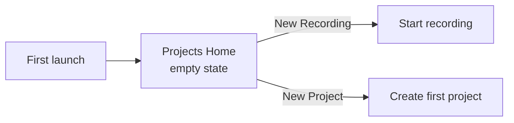
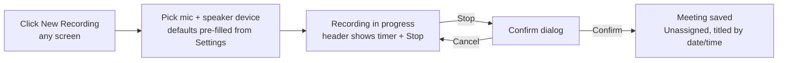
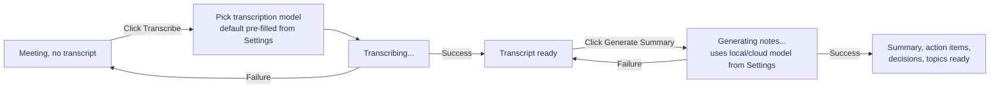
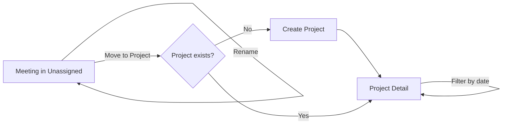
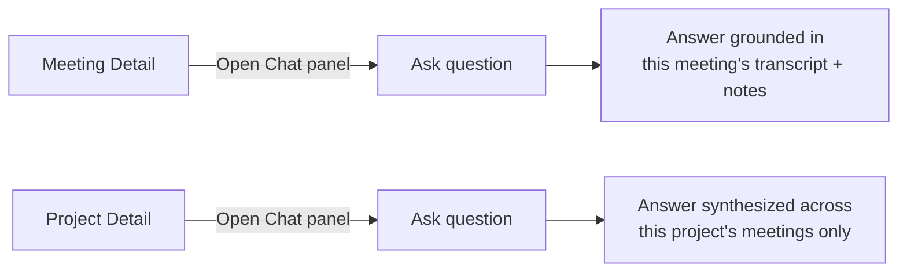

# Scribe — App Flow & User Journeys

## Onboarding & Authentication Flow

Scribe is a local, single-user desktop app (Electron) with no accounts and
no auth (per PRD Target Persona). First launch skips onboarding entirely and
goes straight to the Projects home, empty.

Empty-state copy on first launch explains the two starting actions: **New
Recording** (header button) and **New Project**. No tour, no wizard, no
device-setup step blocking first use — devices are picked at recording time
if no defaults are set in Settings.

## Core Feature Loops

### Record a meeting

**Implements:** `US-01`, `US-02`

The **New Recording** control lives in the header and is reachable from
every screen. Online (mic + speaker) and physical (mic-only) meetings share
one flow — the only difference is whether a speaker/loopback device is
selected.

### Transcribe and generate notes

**Implements:** `US-03`, `US-04`, `US-05`

Fully manual, two separate steps — nothing auto-chains. A meeting can sit
untranscribed indefinitely; a transcript can sit without notes indefinitely.

### Organize into projects

**Implements:** `US-06`

Projects can also be deleted (blocked until empty — meetings must be moved
out or the project detail's meeting list must show zero items first).

### Chat with a meeting or a project

**Implements:** `US-07`, `US-08`

Both chats are slide-over panels toggled from their respective detail
screen, not tabs — they stay available alongside whatever tab (Summary /
Transcript) is currently open on a meeting.

## Screen-by-Screen Map

| Screen | Route | Type | Reached from | Implements | Purpose |
|---|---|---|---|---|---|
| Projects Home | `/` | view | App launch, header logo | `FR-04` | List all projects + Unassigned bucket; entry point for New Recording and New Project |
| Project Detail | `/projects/:id` | view | Projects Home | `FR-04`, `US-06` | List meetings in this project, filter by date, rename/delete project, open project chat |
| Unassigned (placeholder bucket) | `/unassigned` | view | Projects Home | `FR-01`, `FR-04` | List meetings not yet moved into a project; rename or move each |
| Meeting Detail | `/meetings/:id` | view | Project Detail, Unassigned | `US-03`, `US-04`, `US-05`, `US-07` | Summary tab (default) + Transcript tab; Transcribe / Generate Summary actions; chat panel |
| New Recording device picker | modal (any screen) | modal | Header "New Recording" button | `US-01`, `US-02` | Pick mic + speaker/loopback device, start recording |
| Recording in progress | header state | inline | New Recording picker | `FR-01` | Timer + Stop control, visible while a recording is active |
| Meeting chat panel | slide-over | slide-over | Meeting Detail | `US-07` | Q&A grounded in one meeting |
| Project chat panel | slide-over | slide-over | Project Detail | `US-08` | Q&A synthesized across one project's meetings |
| Create / Rename Project | modal | modal | Projects Home, Project Detail, Move-to-Project modal | `FR-04` | Name + optional description |
| Delete Project confirm | modal | modal | Project Detail | `FR-04` | Blocked with explanation if project isn't empty |
| Rename Meeting | modal | modal | Meeting Detail, Unassigned, Project Detail | `FR-04` | Edit meeting title |
| Move Meeting to Project | modal | modal | Meeting Detail, Unassigned, Project Detail | `FR-04`, `US-06` | Pick an existing project or create one inline |
| Settings | `/settings` | view | Header nav | `FR-07` | Local/cloud toggles for notes-gen and chat, default transcription model, default mic/speaker devices |

## State & Edge Logic

### Projects Home
- **Empty (first launch, no projects and no meetings):** hint explaining New Recording and New Project.
- **Loading:** skeleton rows for the project list.
- **Unassigned bucket badge:** shows a count when non-empty; hidden when zero.

### Project Detail
- **Empty (project has no meetings yet):** hint to record or move a meeting in; New Recording button still available.
- **Delete click while non-empty:** confirm modal explains the block and lists the blocking meeting count — no destructive action taken.
- **Date filter with no matches:** "No meetings in this range" message, filter easily clearable.

### Unassigned
- **Empty:** hint pointing at New Recording.
- Meetings here behave identically to meetings inside a project (rename, transcribe, chat) — the only difference is the missing project assignment.

### Meeting Detail
- **No transcript yet:** Summary and Transcript tabs both show a "Transcribe this meeting" prompt with the Transcribe action; chat panel is disabled with a tooltip explaining it needs a transcript first.
- **Transcribing:** progress indicator on the Transcript tab; Transcribe button disabled/shows spinner.
- **Transcription failed:** inline error with the failure reason and a Retry button; meeting stays in "no transcript" state, nothing partial is saved.
- **Transcript ready, no summary:** Summary tab shows "Generate Summary" prompt; Transcript tab shows the full timestamped, speaker-labeled transcript (read-only — manual editing is out of scope per PRD).
- **Generating summary:** progress indicator on the Summary tab; Generate Summary button disabled/shows spinner.
- **Summary generation failed:** inline error with a Retry button; transcript is untouched, no partial summary is saved.
- **Summary ready:** full summary, action items, decisions, and topic breakdown shown (read-only, per PRD).
- **Rename click:** opens Rename Meeting modal, pre-filled with current title.
- **Move to Project click:** opens Move Meeting to Project modal.

### New Recording device picker
- **No devices detected:** error state explaining no mic (and optionally no speaker/loopback device) was found, with a retry/refresh-devices action; Start is disabled until a mic is selected.
- **Speaker/loopback device optional:** leaving it unselected records mic-only (the physical-meeting path); no separate "physical vs online" toggle is shown, the device choice implies it.
- **Devices pre-filled:** from Settings' defaults if set, still changeable per-recording.

### Recording in progress
- **Stop click:** confirm dialog ("Stop recording?") since there is no pause/resume or undo once stopped, per PRD.
- **App-level:** New Recording control is disabled/hidden elsewhere while a recording is active (only one recording at a time).

### Chat panels (meeting and project)
- **No transcript/notes yet (meeting chat):** panel disabled with explanation, per above.
- **Empty project (project chat):** disabled with explanation that the project has no meetings to chat over.
- **Sending a question:** loading indicator on the pending answer; input disabled until it resolves.
- **Answer failed:** inline error on that message with a Retry button; prior conversation history is preserved.

### Create / Rename / Delete / Move modals
- **Create/Rename Project:** name required, Save disabled until non-empty; duplicate names are allowed (projects are disambiguated by date created, not forced-unique names).
- **Move Meeting to Project:** searchable list of existing projects plus an inline "Create new project" option that folds into the Create Project modal.
- **Delete Project:** disabled confirm button while the project has ≥1 meeting, with a count shown.

### Settings
- **Loading:** disabled while defaults are being read on open.
- **Save:** applies immediately per toggle/field (no separate Save button) — each control is its own commit point.
